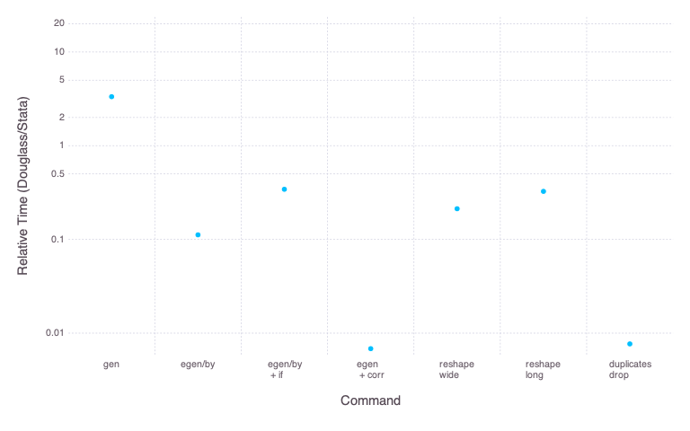

# Douglass.jl

<!---->
<!--


 -->
  [](http://codecov.io/github/jmboehm/Douglass.jl?branch=master)


Douglass.jl is a package for manipulating DataFrames in Julia using a syntax that is very similar to Stata.

## Installation

Douglass is not registered. To install, type `]` in the Julia command prompt, followed by
```
add https://github.com/jmboehm/Douglass.jl.git
```

## Examples

```julia
using Douglass, RDatasets
df = dataset("datasets", "iris")
# set the active DataFrame
Douglass.set_active_df(:df)

# create a variable `z` that is the sum of `SepalLength` and `SepalWidth`, for each row
d"gen :z = :SepalLength + :SepalWidth"
# replace `z` by the row index for the first 10 observations
d"replace :z = _n if _n <= 10"
# drop a variable
d"drop :z"
# construct the within-group mean for a subset of the observations
d"bysort :Species : egen :z = mean(:SepalLength) if :SepalWidth .> 3.0"
```

## Commands implemented

- `generate` -- Creates a new variable and assigns the output from an expression to it.
- `replace` -- Recplaces the content of a variable, but does not change the type.
- `egenerate` (or `egen` for short) -- Creates a new variable. Operates on vectors.
- `ereplace` (or `erep` for short) -- Analogous to `egen`, replaces values of existing variables.
- `drop` -- Drops the specified observations (if used in conjunction with `if`) or variables (without `if`)
- `rename` -- Rename a variable
- `sort` -- Sort the rows activate `DataFrame` by the specified columns
- `reshape` -- Reshape the activate `DataFrame` between wide and long format (`reshape_long`, `reshape_wide`)
- `merge` -- Merge the active `DataFrame` with another one in the local scope (`merge_m1`, `merge_1m`, `merge_11`)
- `duplicates_drop` -- Delete duplicate rows, also by subset of columns

See the [commands documentation page](commands.md) for more details on syntax of these commands.

## REPL mode

Press the backtick (`` ` ``) to switch between the normal Julia REPL and the Douglass REPL mode:


## Benchmarks



These benchmarks are made using a synthetic dataset with 1m observations, on my Macbook Pro (Intel(R) Core(TM) i9-9980HK CPU @ 2.40GHz, Julia 1.6.2).

## Notes

- Better documentation of the interface will come when the package is a bit more stable. In the meantime, the [Test script](https://github.com/jmboehm/Douglass.jl/blob/master/test/Douglass.jl) is probably the best introduction to the interface for those that know Stata.
- Keep in mind that this is not Stata. [Here](differences-from-Stata.md) are some notable differences.

## Roadmap / Todo's

- Implement more commands
- If other people find the package useful, it may be worth making the package extensible, so that other commands can be added in separate packages

## Misc

Douglass.jl is named in honour of the economic historian [Douglass North](https://en.wikipedia.org/wiki/Douglass_North).